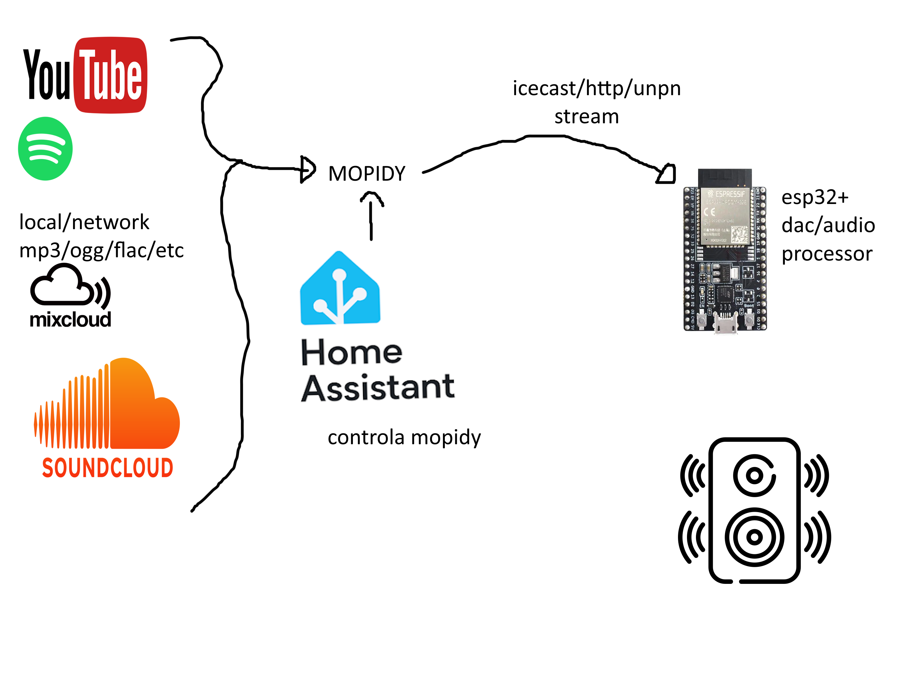

### Reproductor centralizado de música
Darle play en un lugar y que la música por wifi/blutu/aire/magia vaya a otros parlantes distribuidos por lugares.

#### Server
Tenemos un homeassistant andando
Podemos usar [mopidy](https://mopidy.com/) para centralizar playback de local files/spotify/yt que tiene una integración con [HA](https://community.home-assistant.io/t/media-player-platform-for-mopidy/265836) y que esto haga un stream de ICECAST/UNPN o ALGO

- [Similar idea but ugly](https://community.home-assistant.io/t/multi-room-audio-with-snapcast-mopidy-and-home-assistant/42556)
- [Snapcast](https://github.com/badaix/snapcast), una forma de matener synceado cliente y servers

#### Client
Algo como un ESP32+DAC o pico+dac, potenciar y parlantes.

- [internet radio esp32](https://github.com/pisicaverde/yet-another-internet-radio-ESP32): es literal lo que podemos usar de client
- [tinyupnp](https://github.com/ofekp/TinyUPnP)
- [pico audio](https://www.waveshare.com/wiki/Pico-Audio)

